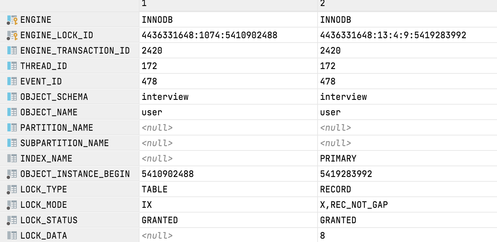
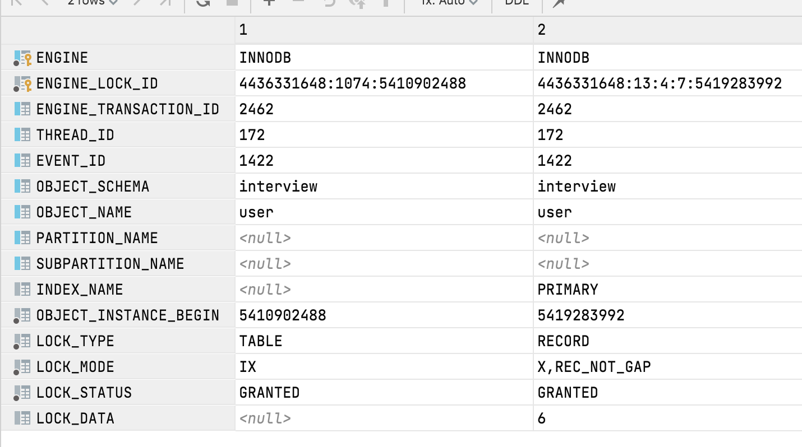
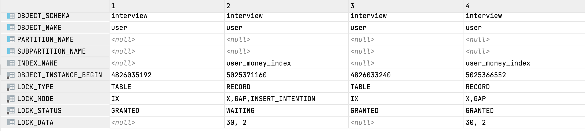

# 脏读, 幻读, 不可重复?

脏读, 读到了假数据, 读脏

> 初始化数据, insert into user(name, money) values ('张三', 0);

| session1                                                     | session2                                        |
| ------------------------------------------------------------ | ----------------------------------------------- |
| begin;                                                       | begin;                                          |
|                                                              | Update interview.user set money=200 where id=1; |
| select * from user where id=1; -- 拿着money去做了一些事情(业务流程) |                                                 |
| commit;                                                      |                                                 |
|                                                              | rollback; -- 遇到错误,回滚了                    |


幻读, 有或无的问题, 第一次读没有这条数据, 第二读的时候有了这条数据

| session1                                                  | session2                                            |
| --------------------------------------------------------- | --------------------------------------------------- |
| begin;                                                    | Begin;                                              |
| Select * from interview.user where money=123; -- 没有数据 |                                                     |
|                                                           | insert into user(name, money) values ('张四', 123); |
|                                                           | commit;                                             |
| Select * from interview.user where money=123; -- 有数据   |                                                     |
| commit;                                                   |                                                     |

我是不是说产生了幻觉?幻读


不可重复读, 数目上面, 两次读出来的个数不一致

| session1                                 | session2                             |
| ---------------------------------------- | ------------------------------------ |
| begin;                                   | Begin;                               |
| Select * from interview.user where id=1; |                                      |
|                                          | Update interview.user set money=999; |
|                                          | commit;                              |
| Select * from interview.user where id=1; |                                      |
| commit;                                  |                                      |

什么情况下会有这些问题?

并发 + 事务(事务隔离级别)+Innodb

隔离级别???是什么?

有四个隔离级别(从上往下越来越高)

1. 未提交读 read uncommited
2. 提交读 read commited
3. 可重复读 repeatable read , 默认
4. 串行化 serializable

| 隔离级别 | 脏读   | 不可重复读 | 幻读   |
| -------- | ------ | ---------- | ------ |
| 未提交读 | 可能   | 可能       | 可能   |
| 提交读   | 不可能 | 可能       | 可能   |
| 可重复读 | 不可能 | 不可能     | 可能   |
| 串行化   | 不可能 | 不可能     | 不可能 |

MySQL为了解决并发问题, 对事物进行了隔离处理.

# 隔离处理是怎么实现的?

用锁来实现的

都有什么锁?作用是什么?

我怎么看这个锁?

还有,阻塞是怎么实现的?

PHP真正运行的时候,和模拟的情况是不是完全一致?

要真正用PHP去处理并发问题?

PHP怎么模拟并发?

PHP要模拟什么样的并发业务?会产生什么问题?

事务隔离级别有四个, 那每个级别下会产生的问题, 都是怎么样产生的?

提高了隔离级别,为什么就能避免这些问题?原理是什么?

唯一索引的问题, MySQL加不加唯一索引, 只是对搜索数据速度有影响

比如, 姓名(unique),如果不加唯一索引,当事务并发的时候, 我用PHP去判断的是否唯一,就没有意义

```php
<?php
  // 比如说要插入名称叫  "张三" 的用户
  $name = "张三";
 //从数据库查找名称是 "张三" 用户
$ret = "select * from user where name=$name";
if($ret){
  $this->error("已存在");
}else{
  // 插入张三
  $sql = " insert into "
}

// 这个数据的唯一性, 就被破坏了
```

嗯, 今天说一下MySQL的锁的类型, MySQL的锁可以按照三种模式来划分

第一种, 就是 按照算法来划分: 记录锁, 间隙锁, 临键锁

这个记录锁, 就是指锁定了某条记录, 间隙锁呢, 就是锁定了一个开区间(>2并且<6 的区间,就是不带等于的区间), 这个就是间隙锁,  临键锁,就相当于是`记录锁`和`间隙锁`的组合,效果是一个闭区间,比如:[2,6)

第二种划分是, 按照共享策略来划分: 分为 共享锁(S), 排它锁(X), 还有,意向共享锁(IS), 意向排它锁(IX)

然后, 这个意向是什么意思呢? 他的英文是 intention, 就是代表, 我要上...锁了, 就是通知一下MySQL, 我要上排它锁, 或者共享锁了, 

然后这个共享呢,英文share, 排它的英文是exclusive, 这就是排他的意思,所以说,这个共享锁的英文就是S

第三种,然后然后然后, 就是按这个加锁策略来分: 悲观锁, 乐观锁, 悲观锁就是, 先加锁,再操作, 乐观锁呢, 就是先操作, 再看有没有冲突

> 意向锁,有什么用呢? 
>
> 意向锁, 是加在表上的, 要加锁之前, 就必须先获取表的意向锁, 比如说, 要加排它锁(行锁), 那就得先获取表的意向排它锁,然后才能加行级的排它锁, 用处就是判断当前表是否 `没有锁` , 如果表上面,没有意向排它锁, 那么这个表,肯定就没有排它锁(共享锁), 如果要加的锁和(排它锁)冲突, 那就可放心的加了, 不然的话, 要遍历每个记录看有没有冲突的锁

者三种策略来分, 就产生了很多种锁的类型, 如下

1. 排它锁(行数据), 因为是在写,修改, 删除的时候, 加的锁, 所以就就近去了第一个字,叫`写锁`
2. 共享锁(行数据), 因为是在读的时候, 加的锁, 所以,又叫`行锁`
3. 间隙排它锁(好多个行), 间隙, 就是在没有的记录上加锁, 现有2,4, 然后一个事务查询<4, 另一个事务插入3,那就会被阻塞, 阻塞的这个锁, 就是间隙锁, 他是锁定了一个范围, 不是锁定的具体行, 插个3.5,照样锁,防止幻读产生
   1. 因为MySQL的隔离级别有四个, ru(read uncommitted), rc(read committed), rr(repeatable read), sr(serialize read), ru和rc模式下, 没有间隙锁, 所以, 你在ru和rc模式下显示的加排它锁(select...for update)或者共享锁(select... in share mode), 也不能解决幻读的问题
4. 间隙共享锁,S_GAP
5. 意向排它锁, 加在表上的, 带意向两个字的都是加在表上的
6. 意向共享锁IS
7. 自动增加锁,AUTO_INC LOCK 有自增列的时候(auto_increment),比如id, 防止并发的时候, 出现两个相同的id, MySQL实现了这个锁的机制, 当然了, 这个锁还有很大的文章, 和主从复制还有关系, 就是还有很多的未知需要探索, 我们以后在一起学习
8. 意向排他间隙锁, IX_GAP
9. 意向共享锁间隙锁IS_GAP
10. 插入意向锁, IIX, 只用于并发插入操作
11. 预测锁???????????,这个还是有待学习

总结:

| 中文 | 英文      | 简写 |
| ---- | --------- | ---- |
| 意向 | intention | I    |
| 排他 | exclusive | X    |
| 间隙 | gap       | GAP  |
| 共享 | share     | S    |

今天也是继续挖坑的一天, 因为我也是遇到了更多的新问题,再见👋🏻


# 触发锁

今天呢, 来做实验, 把这些触发锁的方式总结实验一下

## 1 排它锁触发

预测触发方式: 

1. 显示的加锁, select... for update
2. 自动加锁, 插入, insert...
3. 自动, 修改, update...
4. 自动, 删除, delete..

实验:

问题: 怎么查看锁?

答案: 使用 select * from performance_schema.data_locks; -- >8.0以后的

  select * from information_schema.INNODB_LOCKS;   -- <8.0

### 实验1:显示加锁(REPEATABLE-READ,默认)

```sql
select * from interview.user where id=1; 
```


> 锁类型(TYPE): 表锁(TABLE), 记录锁(RECORD)
>
> 模式(MODE): IX(意向排它锁), X,REC_NOT_GAP

### 实验2: 插入自动加锁(REPEATABLE-READ)

```sql
begin;
insert into interview.user(name,money) values ('张三', 200);
commit;
```

>  只有一个意向排它锁


### 实验3: 修改(REPEATABLE-READ)

```sql
begin;
update interview.user set money=10 where id=2;
commit;
```


### 实验4: 删除(REPEATABLE-READ)

```sql
begin;
delete from interview.user where id=1;
commit;
```


总结: 在主动加锁,修改, 删除的时候, 有IX, X, 在增加的时候, 只有意向排它锁

问题:增加的时候是不是, 任何情况下都只有意向排它锁? 还是有别的情况, 会IX和X都加?有没有这种情况

那在其他的隔离级别上, 使用如上语句会有什么区别呢?

我们下期再见!今天就先这样, 再见👋🏻

## 实验5: 插入在ru(read uncommitted) 模式下的排它锁情况

修改隔离级别

```sql
set session transaction isolation level read uncommitted ;
show variables like '%isolation%';
```

```sql
begin;
insert into interview.user(name,money) values ('张三', 200);
commit;
```


## 实验6: ru 删除

```sql
begin;
delete from interview.user where id=3; -- 如果不存在就只有IX
commit;
```


> 如果, 删除的数据不存在, 只有IX
>
> 如果, 删除的数据存在, 有IX 和 X


### 实验7: ru 修改

如果有数据, 就加IX和X

```sql
begin;
update interview.user set money=11 where id=8; -- 有数据
commit;
```


如果没有数据, 就只加IX

```sql
begin;
update interview.user set money=11 where id=3; -- 没有数据
commit;
```


### 实验8: 查询(select...for update)

普通的select... 这个应该是不加锁的, 实验验证没有问题

如果查询的数据不存在, 那么就只有一个IX

```sql
begin;
select * from interview.user where id=1 for update ; -- id 是1 的数据已经被删除了
commit ;
```


如果, 查询的数据存在, 那么在加上IX之后, 还会加上X

```sql
begin;
select * from interview.user where id=6 for update ; -- id=6的数据是存在的
commit ;
```


> 小结: 没有数据的时候, 为什么只有IX呢?因为行锁要加在数据上, 然后MySQL在表上面加了IX之后, 去找这条记录, 为了去加X锁, 但是, 没找到, 那就没法加锁了
>
> 从这里我们也能看出来, 加锁的顺序, 就是先加意向...锁(在表上加), 然后在到记录上加行锁, 如果没有,就不加


然后然后然后,再见👋🏻,下期见

然后!!!, 我们继续看rc隔离级别下, 排它锁的触发

### 实验9: RC 排它锁 添加

修改隔离级别, 用工具修改也可以

```sql
set session transaction isolation level read committed ;
show variables like '%isolation%';
```

```sql

begin;
insert into interview.user(name,money) values ('张三2', 200);
select * from interview.user;
commit;
```


### 实验10: RC 排他 删除

如果有数据,IX和X

```sql
begin;
delete from interview.user where id=4; -- 数据存在
select * from interview.user where id=4;
commit;
```


如果没有数据


```sql
begin;
delete from interview.user where id=4; -- 此时数据已经不存在了
select * from interview.user where id=4;
commit;
```


### 实验11: 修改 rc 排他

如果有数据, IX和X

```sql
begin;
select * from interview.user where id=8;
update interview.user set money=12 where id=8; -- 有这条记录
commit;
```


如果没有数据, IX

```sql
begin;
select * from interview.user where id=8;
update interview.user set money=11 where id=3; -- 没有这条记录
commit;
```


### 实验12: rc, 排他, 查询

如果有数据,IX 和 X

```sql
begin;
select * from interview.user where id=6; -- 有记录 普通的select 没有锁
select * from interview.user where id=6 for update ; -- 有记录X
commit ;
```


如果没有数据,IX

```sql
begin;
select * from interview.user where id=1; -- 没有记录
select * from interview.user where id=1 for update ;  -- id 是1 的数据已经被删除了, 只有X
commit ;
```


然后还是, 我们下期再见👋🏻, 下期就是, rr下的排它锁了, 可能会出现间隙锁

好, 我们接着上次的实验继续.

修改隔离级别

```sql

set session transaction isolation level repeatable read ;
show variables like '%isolation%'
```


### 实验13: rr级别 排他, 增加

```sql
begin;
insert into interview.user(name,money) values ('张三3', 200);
select * from interview.user;
commit;
```


### 实验14: rr, 排他, 删除

没有数据的时候 ,加了IX 和(X,GAP), GAP间隙锁以后在讨论, 做间隙锁实验的时候再讨论

```sql
begin;
# 删除
delete from interview.user where id=4; -- 没有
select * from interview.user where id=4;
rollback;
commit;
```


有数据的时候

```sql
begin;
# 删除
select * from interview.user where id=5;
select * from interview.user where id=5;
rollback;
commit;
```


### 实验15: rr 修改, 排他

有数据的时候, IX, (X,REC_NOT_GAP)

```sql
begin;
# 修改
select * from interview.user where id=8;
update interview.user set money=13 where id=8; -- 有这条记录
commit;

```




没有数据的时候, IX,(X,GAP)

```sql
begin;
# 修改
select * from interview.user where id=3;
update interview.user set money=11 where id=3; -- 没有这条记录
commit;

```


### 实验16: 查询 rr 排他

有数据: IX, (X,REC_NOT_GAP)

```sql
begin;
select * from interview.user where id=6; -- 有记录, 普通查, 没有锁
select * from interview.user where id=6 for update ; -- 有记录
commit ;
```


没有数据: IX, (X,GAP)

```sql
begin;
select * from interview.user where id=1; -- 没有记录, 普通查, 没有锁
select * from interview.user where id=1 for update ;  -- id 是1 的数据已经被删除了
commit ;
```


> 总结: 在rr级别下, 如果记录不存在, 就会加间隙锁, 就是, 行锁的排它锁加不上, 在rr隔离级别下, 就会加间隙锁, 但是这个间隙锁的特性, 我们以后在讨论

> 排它锁的特性, 加上排它锁, 别人不能再加排它锁, 也不能再加共享锁,  因为, 增删改,是自动切必须加排它锁的, 也就是说, 没法做 增删改的操作了, 查的话, 只能用普通查, select... , 显示的加锁查, 就不能用了, select ... for update , 还有 select ... in share mode 就会被阻塞.

实验17: 排它锁的特性(阻塞情况)

```sql
begin;
select * from interview.user where id=6; -- 普通查不会被阻塞, 因为不需要加锁
select * from interview.user where id=6 for share ; -- 显示的加共享锁, 会被阻塞
insert into interview.user(name,money) values ('张三3', 200); -- 这样加不会被阻塞, 因为行锁,在6这条记录上, 他是允许id<>6的记录增加的
insert into interview.user(id,name,money) values (6,'张三3', 200); -- 这样加不会被阻塞, 因为行锁,在6这条记录上, 他是允许id<>6的记录增加的 即使这条记录本身就不会添加成功, 也会先被阻塞掉
delete  from interview.user where id=6; -- 因为删除之前, 也会先上锁, 再删除, 如果上不上, 就会阻塞 实验验证确实被阻塞了
update interview.user set money=111 where id=6; -- 被阻塞 因为在修改之前, 先获取锁, console_1的锁没有释放, 这里无法获取锁, 所以就会被阻塞
-- 被阻塞的时候不能提交, 能不能回滚呢? 我猜应该是可以的 猜错了, 回滚不了
-- 回滚都回滚不了, 只能获取锁的那边先回滚或者提交
rollback;
commit;
```

那么, 我们下期再见👋🏻

还有最后一个隔离级别

serializable 串行化

我的理解, 就是串起来, 顺序执行, 就是说不允许并发,不管什么操作就先加锁

### 实验17: S+ 排他, 增加

修改隔离级别

```sql
set session transaction isolation level serializable ;
show variables like '%isolation%';
```

开始实验:

```sql
begin;
# 增加
insert into interview.user(id,name,money) values (16,'张4', 200);
insert into interview.user(name,money) values ('张4', 200); -- 在serializable模式下, 不管有没有索引列都是只有一个IX
commit;
```


### 实验18: S+ 排他 删除

没有记录

```sql
begin;
# 删除
delete from interview.user where id=4; -- 没有
rollback;
commit;
```


有记录

```sql
begin;
# 删除
delete from interview.user where id=5; -- 有记录
rollback;
commit;
```


### 实验19: S+ 排他 修改

有记录

```sql
begin;
# 修改
# 注意这里不能使用查询, 不然锁就乱了了, 会加共享锁, 实验效果出不来
update interview.user set money=14 where id=8; -- 有这条记录
commit;
```


没有记录IX, (X,GAP)

```sql
begin;
# 修改
update interview.user set money=11 where id=3; -- 没有这条记录
commit;
```


### 实现19: S+ 排他 查询

有记录, 加的不是排它锁, 是共享锁S(Share Lock),具体情况:IS, (S,REC_NOT_GAP)

```sql
begin;
select * from interview.user where id=6; -- 有记录, 普通查, 有锁(S,REC_NOT_GAP)
select * from interview.user where id=6 for update ; -- 有记录
rollback ;
commit ;
```


普通查


显示加锁查



没有记录:IS,(S,GAP)

```sql
begin;
select * from interview.user where id=1;  -- 没有记录, 普通查, 在serializable模式下会自动加锁,共享锁
select * from interview.user where id=1 for update ;  -- id 是1 的数据已经被删除了
rollback ;
commit ;
```

普通查:IS,(S,GAP)


显示加锁(select ... for update), IX, (X,GAP)


> 总结: 通过实验验证, 在serializable隔离模式下, 使用普通查, 也会自动加`共享锁` 如果显示的加(...for update), 就只有排它锁, 没有共享锁了

好了, 我们下期见

接下来我们了说一下读锁, 共享锁, Share Lock

## 2共享锁的触发

共享锁, 又叫读锁, 英文是Share Lock , 就是在读取的时候加的锁, 所以叫读锁, 顾名思义, 在读取的时候才会加这个锁

在RU, RC,RR,S+隔离模式下, select 语句是否加读锁, 是怎么加的

实验sql

```sql
begin;
# 普通, 有索引,有记录
select * from interview.user where id=6;

# 普通, 有索引,没记录
select * from interview.user where id=3;

# 普通, 无索引,有记录
select * from  interview.user where money=200;

# 普通,=没有索引, 没记录
select * from  interview.user where money=1;

#
# 显示加锁, 有索引,有记录
select * from interview.user where id=6 for share ;
select * from interview.user where id=6 lock in share mode ;

# 显示加锁, 有索引,没记录
select * from interview.user where id=3 for share ;

# 显示加锁, 无索引,有记录
select * from  interview.user where money=200 for share ;

# 显示加锁,=没有索引, 没记录
select * from  interview.user where money=1 for share ;


#  为什么小于会加间隙锁, 大于不会加间隙锁?
select * from interview.user where id>3; -- 大于的条件 不会加 间隙锁 GAP
select * from interview.user where id<6; -- 小于的条件会加 间隙锁(S,GAP)


begin;
```


查询是否加读锁:

| 查询                           | RU                                     | RC                                     | RR                                                         | S+                                                         |
| ------------------------------ | -------------------------------------- | -------------------------------------- | ---------------------------------------------------------- | ---------------------------------------------------------- |
| 普通,=条件有索引, 有记录       | 没有                                   | 没有                                   | 没有                                                       | IS, (S,REC_NOT_GAP)                                        |
| 普通,=条件有索引, 没有记录     | 没有                                   | 没有                                   | 没有                                                       | IS, (S,GAP)                                                |
| 普通,=条件没有索引, 有记录     | 没有                                   | 没有                                   | 没有                                                       | IS,S(所有行都加了共享锁), LOCK_DATA=supremum pseudo-record |
| 普通,=没有索引, 没记录         | 没有                                   | 没有                                   | 没有                                                       | IS,S(所有行都加了共享锁), LOCK_DATA=supremum pseudo-record |
| 显示加锁,=条件有索引, 有记录   | 有                                     | IS,(S,REC_NOT_GAP)                     | IS,(S,REC_NOT_GAP)                                         | IS,(S,REC_NOT_GAP)                                         |
| 显示加锁,=条件有索引, 没有记录 | IS                                     | IS                                     | IS, (S,GAP)                                                | IS, (S,GAP)                                                |
| 显示加锁,=条件没有索引, 有记录 | IS,(S,REC_NOT_GAP)(所有行都加了共享锁) | IS,(S,REC_NOT_GAP)(所有行都加了共享锁) | IS,S(所有行都加了共享锁), LOCK_DATA=supremum pseudo-record | IS,S(所有行都加了共享锁), LOCK_DATA=supremum pseudo-record |
| 显示加锁,=没有索引, 没记录     | IS                                     | IS                                     | IS,S(所有行都加了共享锁), LOCK_DATA=supremum pseudo-record | IS,S(所有行都加了共享锁), LOCK_DATA=supremum pseudo-record |

### 发现问题  为什么小于会加间隙锁, 大于不会加间隙锁?

```sql
select * from interview.user where id>3; -- 大于的条件 不会加 间隙锁 GAP
select * from interview.user where id<6; -- 小于的条件会加 间隙锁(S,GAP)
```

大于是加了锁的, LOCK_MODE=S, LOCK_DATA = supremum pseudo-record 的作用就相当于加了next-key(临键锁), 达到了间隙锁的效果

supremum pseudo-record, 这是什么???

意思是比最大的索引值还要大, LOCK_DATA=supremum pseudo-record 的时候, 就相当于加了 next-key(临键锁)

显示的加锁

select ... lock in share mode

select... for share


今天先到这里, rr和rc下的实验, 我们下期再做, 再见👋🏻

我们来做, rr 和rc 下的实验

先修改隔离级别

> 总结: ru和rc模式下是没有间隙锁的,GAP, 这就导致了, 查询在没有记录的时候只在表上加IS,在查询条件没有索引的时候, 所有行加的共享锁类型是(S,REC_NOT_GAP), 因为没有间隙锁, 即使显示的加锁, 也不能解决幻读的问题

隔离级别在ru和rc模式下的实验

```sql
set session transaction isolation level read committed ;
set session transaction isolation level read uncommitted ;
show variables like '%isolation%';
```

| 事务A                                                        | 事务B                                                        |
| ------------------------------------------------------------ | ------------------------------------------------------------ |
| begin                                                        | begin;                                                       |
| select * from interview.user where id>3; -- 只会在已有记录上加锁, 没有间隙锁 |                                                              |
|                                                              | insert into interview.user(id,name,money) values (6,'张三3', 200); -- 插入成功 |
|                                                              | commit;                                                      |
| select * from interview.user where id>3;  -- 再次读取的时候, 发现上一次读取多了一条记录, 发生了幻读 |                                                              |

这一期视频就先到这, 下期还是做实验, 就是做一下间隙锁和临键锁的实验, 好的,再见👋🏻

# 间隙锁和临键锁

> 间隙锁, 就是不存在的记录, 在一个区间上锁 比如说, 现在有记录 1,(2),3,(4,5) 6

### 实验20: 间隙锁的触发

事务隔离级别在RU和RC模式下,是没有间隙锁的

X 和 (X,GAP) 和 (X, REC_NOT_GAP) 有什么区别呢?

我的理解: X是排它锁, 包括了~~两~~左边的间隙,X_GAP 表示小于当前记录的所有间隙,(X, REC_NOT_GAP) 表示锁定当前一条记录

准备环境:

```sql
# 表
CREATE TABLE `user` (
  `id` int NOT NULL AUTO_INCREMENT,
  `name` varchar(200) DEFAULT NULL,
  `money` int DEFAULT NULL,
  PRIMARY KEY (`id`),
  KEY `user_money_index` (`money`)
) ENGINE=InnoDB DEFAULT CHARSET=utf8mb4 COLLATE=utf8mb4_0900_ai_ci;

# 数据
truncate table interview.user;
insert into interview.user(name, money) VALUE ('间隙锁',10);
insert into interview.user(name, money) VALUE ('间隙锁2',30);
select * from interview.user;
```

| 事务A                                                        | 事务B                                                        | 查看锁                                             |
| ------------------------------------------------------------ | ------------------------------------------------------------ | -------------------------------------------------- |
| set session transaction isolation level repeatable read ;<br /> show variables like '%isolation%'; | set session transaction isolation level repeatable read ;<br /> show variables like '%isolation%'; |                                                    |
| begin;                                                       | begin;                                                       |                                                    |
| update interview.user set name='xx' where money=20;          |                                                              |                                                    |
|                                                              |                                                              | select * from information_schema.INNODB_TRX;       |
|                                                              |                                                              | select * from performance_schema.data_locks; # 图1 |
|                                                              | insert into user (name, money) values ('新纪录',11); -- 被阻塞 |                                                    |
|                                                              |                                                              | select * from performance_schema.data_locks; #图2  |
|                                                              | 等待超时之后                                                 |                                                    |
|                                                              |                                                              | select * from performance_schema.data_locks; #图3  |
| Inset                                                        |                                                              |                                                    |
|                                                              |                                                              | 看锁的情况 图4                                     |


> 图1
>
> 

> 图2
>
> 

> 图3
>
> \[40001\\[1205\] Lock wait timeout exceeded; try restarting transaction
>
> 

> 图4
>
> ```sql
> insert into interview.user(name, money) VALUE ('间隙锁300',300); -- 不再(10,30)的间隙内
> ```
>
> 

X,GAP 他是在哪个间隙加到锁[10,30),11又在间隙中, 所以就被阻塞了?

为什么不再20上直接加锁?那样不就不影响插入了吗?MySQL加锁的方式, `根据索引和已有记录去加锁`, 如果有money15这条记录, 他就会在(间隙15,30)加锁, 那就不会影响11的并发插入了

> 注意: 在业务操作的时候不要update一条不存在的记录, 这样会影响其他事务并发插入数据, 降低了并发的性能
>
> 我们应该, 先select记录是否存在, 如果存在在来执行update操作, 就能避免这个问题
>
> 那MySQL为什么不这样做呢?

> 总结: 除了update操作, 删除操作, 也要先查看记录是否存在
>
> 还有, 修改/删除的范围条件, 在并发业务中,要尽量少使用
>
> 比如 money>20, 如果已有记录10,30 插入11会被阻塞, 我们可以先select >20(快照读,不会加锁->阻塞) , 查询出记录的id, 然后用id去删除, id in(....), 就不会阻塞11插入了, 这样的话就能大大的增加并发性能

好,那么今天就先到这里, 我们下期再见👋🏻

下期说一下, 为什么rr级别没有完全解决幻读的问题, 什么情况解决了, 什么情况没有解决, 然后回顾一下以前遇到的问题, 看看哪些还没有解决, 要不要马上解决.